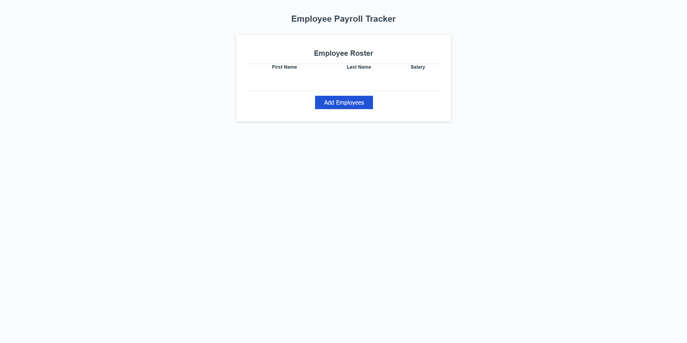

## Week 3 Challenge


## User Story

```md
AS A payroll manager
I WANT AN employee payroll tracker
SO THAT I can see my employees' payroll data and properly budget for the company
```

## Acceptance Criteria

```md
GIVEN an employee payroll tracker
WHEN I click the "Add employee" button
THEN I am presented with a series of prompts asking for first name, last name, and salary
WHEN I finish adding an employee
THEN I am prompted to continue or cancel
WHEN I choose to continue
THEN I am prompted to add a new employee
WHEN I choose to cancel
THEN my employee data is displayed on the page sorted alphabetically by last name, and the console shows computed and aggregated data
```

## Development Process
For this week's challenge we were given starting code that was not functional.
Following the user story and acceptance criteria, I programmed the collectEmployees function.
This function prompts the user to input values for their employees. These values include "first name", "last name", and "salary".
The function then pushes those values into an object labeled "employee". This object in then used in starter code functions to render a table of the collected values.
A function, "displayAverageSalary", was then created to calculate and display the average of all input "salary" values within the page console.
Finally, a function was created to display the "first name" and "last name" values of a randomly selected employee from the rendered table.
A screenshot of the deployed application is included below.



All code used to complete this assignment was written by me, Robert Maxfield.